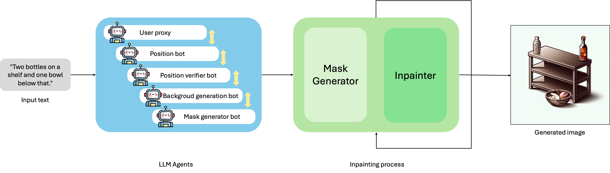

# PicassoGen: Picture Assembler System using Stepwise Object Arrangement

## Overview

**PicassoGen** is a novel framework for controllable text-to-image generation. It is designed to accurately reflect complex prompts that involve **object positioning** and **numerical constraints**, which are commonly problematic for existing diffusion-based models.

PicassoGen introduces:
- **LLM-based autonomous agents** that handle prompt decomposition, planning, and mask generation.
- **Iterative inpainting**, replacing layout-to-image generation with subgoal-based image construction.

<p align="center">
  
</p>

<p align="center"><b>Figure 1:</b> Overview of our PicassoGen framework for text-to-image generation.</p>

---

## Qualitative Results

<p align="center">
  
</p>

<p align="center"><b>Figure 2:</b> Qualitative comparison for the prompt: "Two bottles on the shelf and one bowl below that".</p>

PicassoGen shows significantly better spatial understanding and object count accuracy than baseline models like **Stable Diffusion** and **DALL-E**.

---

## Paper 📄

You can read the full paper [here](./PicassoGen.pdf) for technical details, experiments, and analysis.

---

## Installation

1. **Clone the repository**:
    ```bash
    git clone https://github.com/chaksseu/PicassoGen.git
    cd PicassoGen
    ```

2. **Create a conda environment**:
    ```bash
    conda create -n picassogen python==3.9 -y
    conda activate picassogen
    ```

3. **Install dependencies**:
    ```bash
    pip install -r requirements.txt
    ```

4. **Set up environment variables (OpenAI API key)**:
    - Create a `.env` file and add your OpenAI API key:
      ```
      OPENAI_API_KEY="YOUR_API_KEY"
      ```
    - Also, set your key in `configs/OAI_CONFIG_LIST_4o.json`.

---

## Usage

1. **Prepare a text prompt**:
    ```text
    "Draw one panda on the left side and 2 monkeys on the right side."
    ```

2. **Run the main script**:
    ```bash
    python main.py --prompt "Draw one panda on the left side and 2 monkeys on the right side."
    ```

3. **Generated files**:
    - Final images and intermediate masks are saved in the `results/` directory.

---

## Components

### 🤖 LLM Agents

We use GPT-4o agents under the [AutoGen](https://github.com/microsoft/autogen) framework:

- `User Proxy`: Initial prompt handler and task dispatcher
- `Position Bot`: Computes bounding boxes for each object
- `Position Verifier Bot`: Validates layout feasibility
- `Background Generator`: Creates a suitable background
- `Mask Generator`: Outputs segmentation masks for inpainting

### 🎨 Inpainting Pipeline

Using DALL·E and Stable Diffusion for:
- Background generation
- Object-by-object iterative inpainting

### ⚙️ Configuration

All configs are in the `configs/` directory. This includes:
- Prompt templates
- Model selection
- Image resolution and sampling settings

---

## Contributors 👩‍💻👨‍💻

<a href="https://github.com/chaksseu"></a>
<a href="https://github.com/csjihwanh"></a>
<a href="https://github.com/xwsa568"></a>
